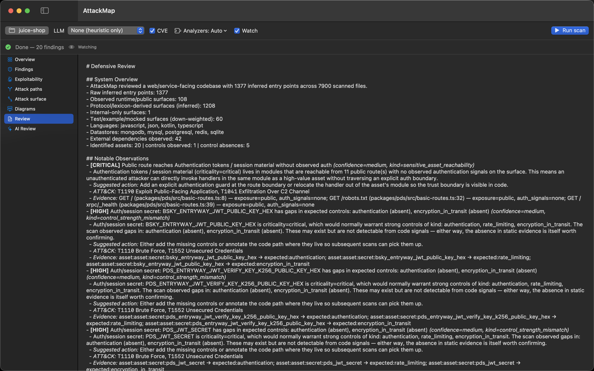
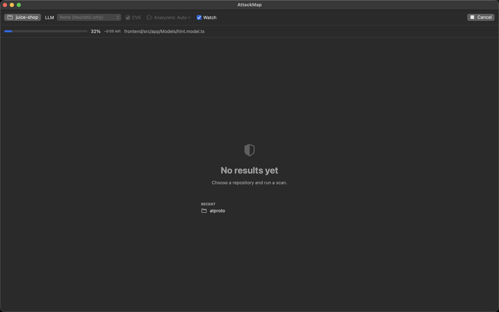
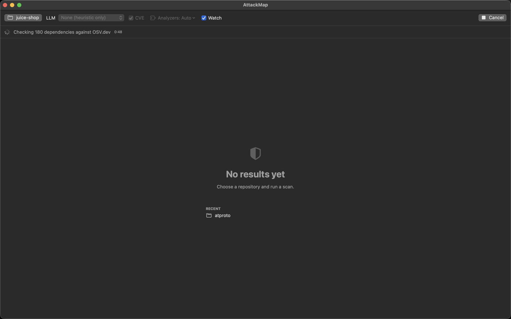
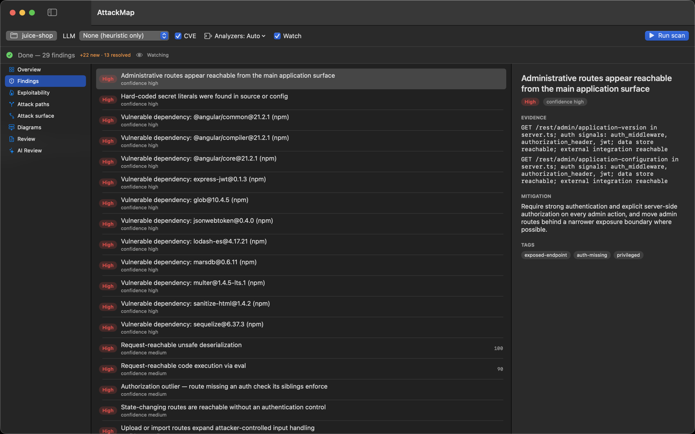
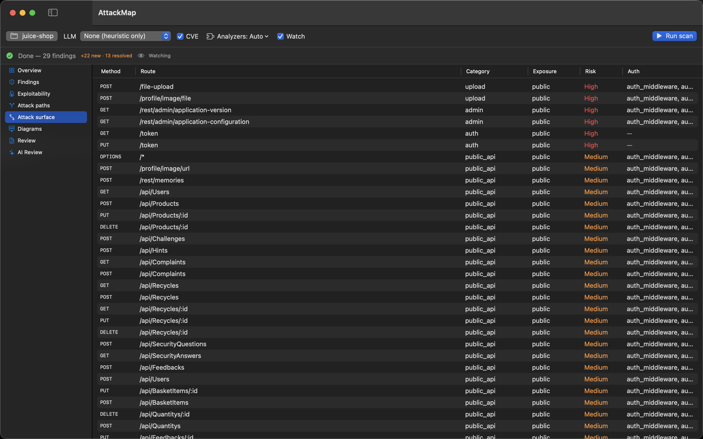

# macOS app

A native SwiftUI front-end that drives the `attackmap` CLI and renders its
results — pick a repo, run a scan, and browse findings, exploitability, attack
paths, diagrams, and the AI review without leaving the app.

## Install

```bash
brew install --cask mlaify/tap/attackmap-app
```

The cask depends on the `attackmap` formula, so this installs the CLI too. Update
both together:

```bash
brew upgrade --cask attackmap-app
```

Requires macOS 15 (Sequoia) or later.

## Features

- **Repo picker + Run/Cancel** with live progress and ETA.
- **Analyzers** — Automatic (by language) or pin specific modules.
- **AI review** — provider (Claude / OpenAI · Codex), model, reasoning, and Fast toggle. API keys are stored in your login Keychain.
- **Watch mode** — auto re-scan on file changes, with new-vs-resolved deltas.
- **Result views** — Overview, Findings, Exploitability, Attack paths, Attack surface, Diagrams (rendered Mermaid), Review, and AI Review.

The app feature-detects the installed CLI, so newer options light up as you
upgrade. Source and issues: [github.com/mlaify/AttackMap-mac](https://github.com/mlaify/AttackMap-mac).

## Screenshots

A full run against [OWASP Juice Shop](https://github.com/juice-shop/juice-shop),
from configuring the scan to browsing exploitable paths.

### Configure and run

Pick a repo, choose an LLM mode (or none for a fast heuristic-only pass), toggle
CVE cross-referencing and Watch mode, then **Run scan**.



Live progress with a per-file bar and ETA while scanning, then the dependency
CVE cross-reference against OSV.dev:





### Overview

Headline counts, findings by severity, and the single most exploitable
route→sink path, front and center.


### Findings

A master-detail list — every finding with its severity, evidence, remediation,
and ATT&CK tags.



### Exploitability

Route→sink paths fused and ranked by an "exploitable now" score, so triage leads
with the combinations that actually matter.


### Attack surface

The full route inventory — method, path, category, exposure, risk, and the auth
signals observed on each.



### Diagrams

Attack paths rendered as offline Mermaid flowcharts (entry → service → sink).


### Defensive review

The full Markdown review — system overview and notable observations with
suggested actions and ATT&CK mappings.


