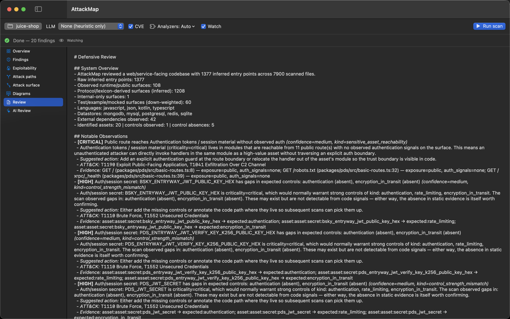
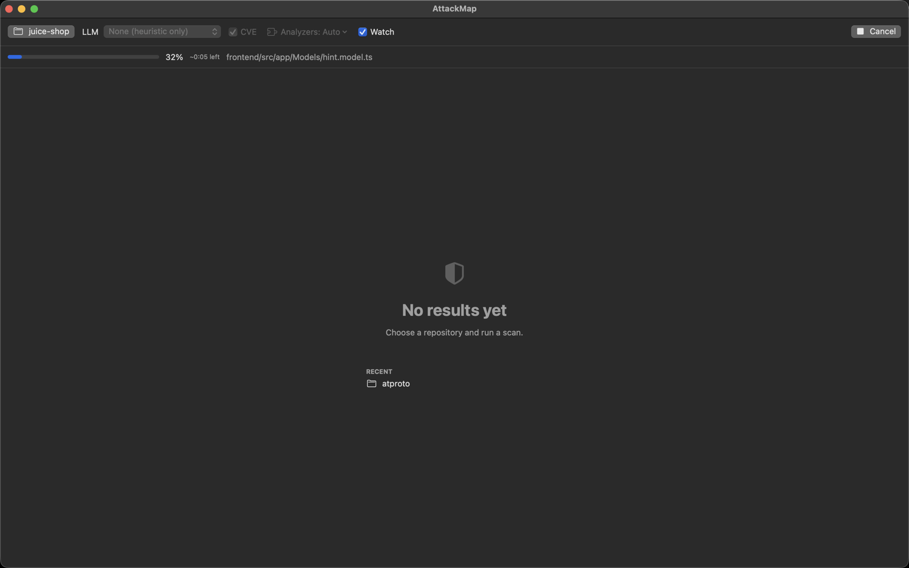
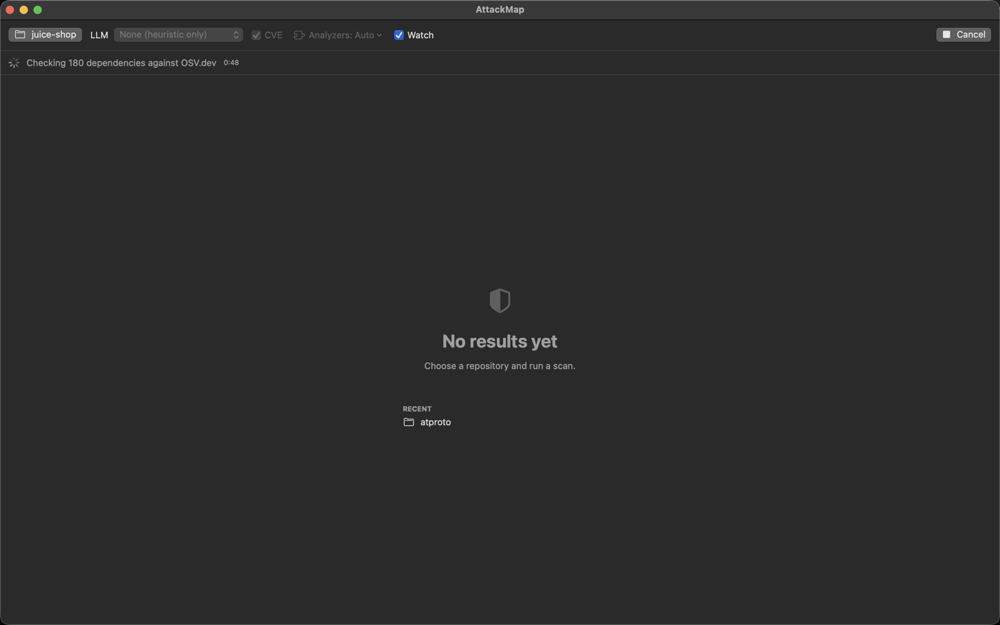
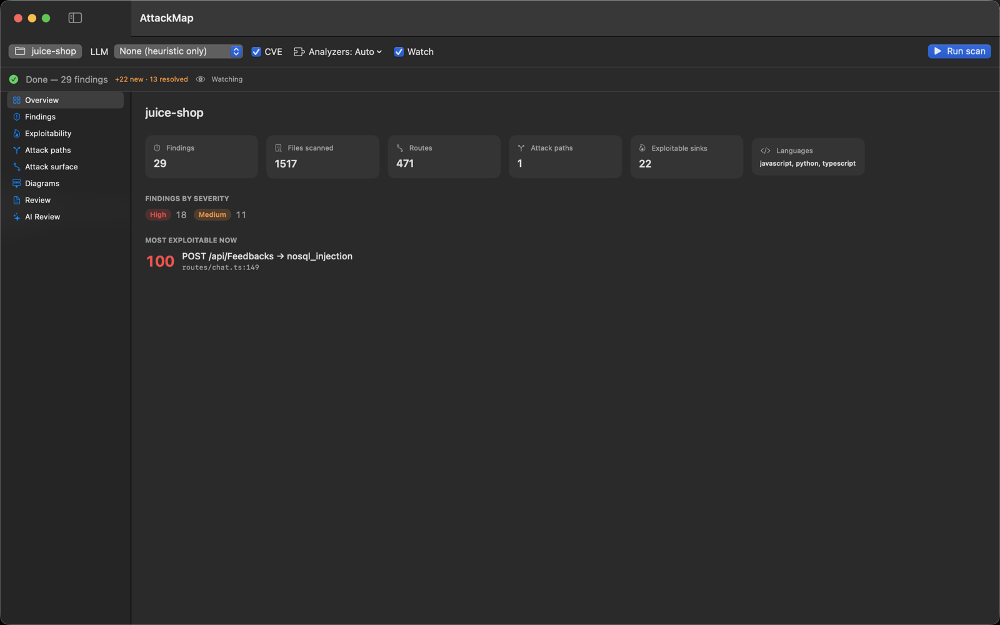
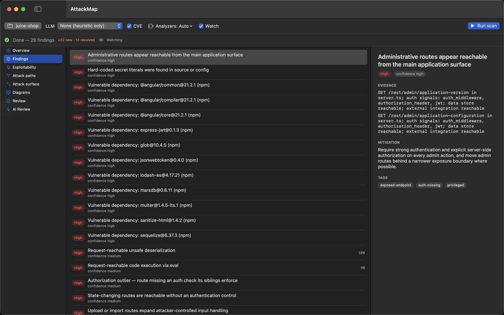
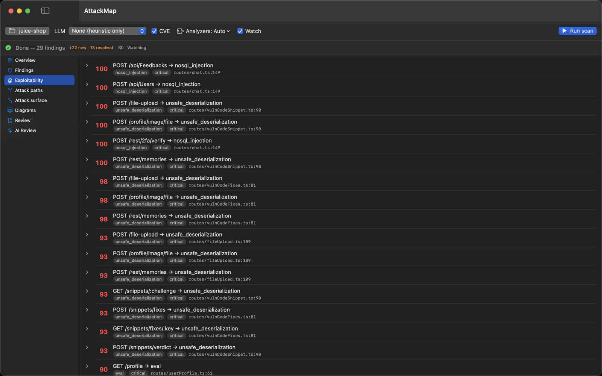
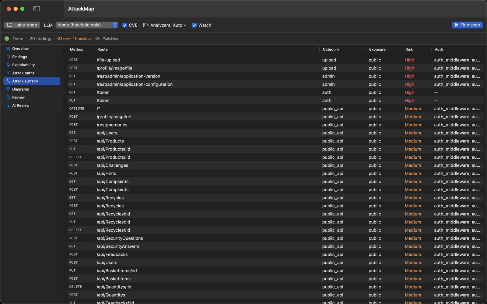
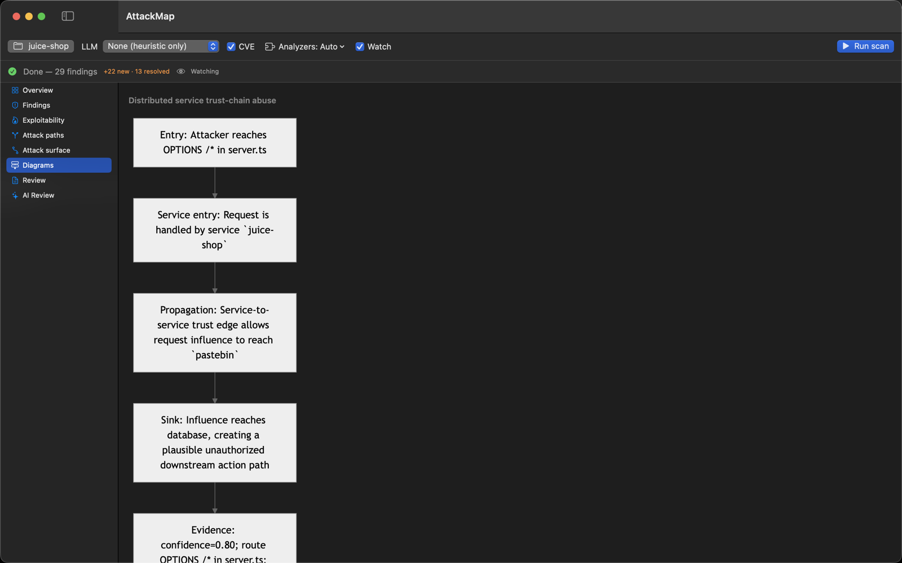
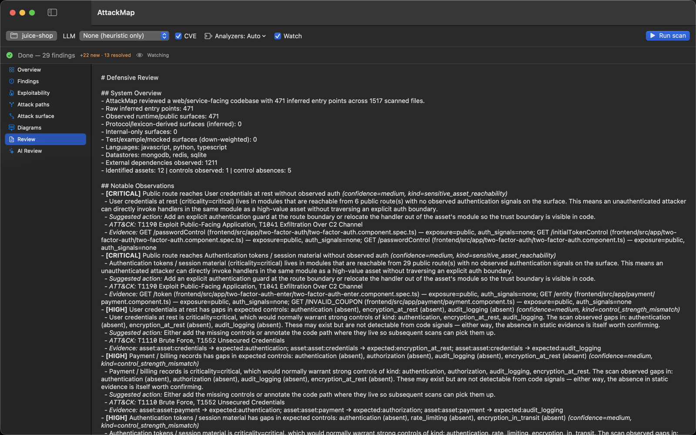

# macOS app

A native SwiftUI front-end that drives the `attackmap` CLI and renders its
results — pick a repo, run a scan, and browse findings, exploitability, attack
paths, diagrams, and the AI review without leaving the app.

## Install

Install the notarized app with Homebrew:

```bash
brew install --cask mlaify/tap/attackmap-app
```

The cask depends on the `attackmap` CLI formula, so this also installs the
CLI (`brew install mlaify/tap/attackmap`). The app drives that CLI rather than
bundling its own engine. Upgrade both with `brew upgrade`. Signed and
notarized DMGs are also attached to each
[GitHub release](https://github.com/mlaify/AttackMap-mac/releases).

Requires macOS 15 (Sequoia) or later.

### Build from source

You need Xcode 16+, [XcodeGen](https://github.com/yonaskolb/XcodeGen) and the
`attackmap` CLI on your `PATH`:

```bash
brew install xcodegen mlaify/tap/attackmap
git clone https://github.com/mlaify/AttackMap-mac.git
cd AttackMap-mac
xcodegen generate          # creates AttackMap.xcodeproj from project.yml
open AttackMap.xcodeproj   # build and run (⌘R)
```

Re-run `xcodegen generate` after pulling changes that add or rename Swift
files. See the [AttackMap-mac README](https://github.com/mlaify/AttackMap-mac)
for details.

### Finding the CLI

The app looks for `attackmap` at the path set in Settings, then on your login
shell's `PATH`, then in `/opt/homebrew/bin`, `/usr/local/bin` and
`~/.local/bin`, so Homebrew, pipx and pip installs are all found.

## Features

- **Repo picker, Run and Cancel**, with live per-file progress and ETA.
- **Analyzers**: Automatic (the engine picks by repo) or pin specific modules.
- **CVE**: SBOM cross-reference against OSV.dev (`--cve`).
- **Recall mode** (`--recall`): wider, speculative taint discovery. The extra
  reach is marked speculative and kept out of the high-severity gate.
- **Suppression controls**: ignore all suppressions for a full audit
  (`--no-suppress`) or point at an explicit baseline (`--suppress-file`).
  Suppressed findings still appear, collapsed, under Findings with their reason.
- **LLM modes**: Review (`--llm`), Hunt (`--hunt`), Hunt + verify
  (`--hunt --verify`), Remediate (`--remediate`) and Triage (`--triage`).
  Provider (Claude or OpenAI · Codex), model, reasoning and a Fast toggle apply
  to all of them. API keys are stored in your login Keychain.
- **Verify jury** for Hunt + verify: votes (`--verify-votes`), lenses
  (`--hunt-lenses`), rounds (`--hunt-rounds`) and a token budget
  (`--hunt-budget`).
- **Cross-repo / fleet scans**: select two or more folders to run
  `attackmap analyze repoA repoB …`. The fleet view shows a per-repo rollup,
  contract links, cross-boundary (confused-deputy) flows, trust-assumption gaps,
  cross-repo control anomalies and the fleet graph.
- **Watch mode**: re-scans automatically (debounced) when files change and
  shows what's new and what's resolved since the previous scan.
- **Result views**: Overview, Findings, Exploitability, Attack paths, Attack
  surface, Diagrams (Mermaid, rendered offline), Review and AI Review.
- **Recent scans** and **Settings** (CLI path, API keys).

### Where output goes

The app always runs the CLI with `--format all` and writes **outside** the
scanned repo, so a scan never shows up in `git status`:

- single repo: `~/Library/Application Support/AttackMap/scans/<repo>-<hash>/reports/`
- fleet scan: `~/Library/Application Support/AttackMap/scans/fleet-<first repo>-<hash>/fleet/`
  (one subdirectory per repo plus `fleet-summary.json` / `.md`)

The hash is derived from the repo path (or the set of fleet repos), so rescans of
the same repo reuse one directory. **Reveal Reports** in the status bar opens it
in Finder. These are ordinary AttackMap reports, the same files
`attackmap analyze -o` writes.

App versions before the next release (0.2.2 and earlier) wrote into
`<repo>/.attackmap-gui/` instead; that directory can be deleted.

### CLI versions

The app feature-detects the installed CLI from `attackmap analyze --help`. An
option the CLI doesn't support is never passed, and a mode it lacks entirely
stops with a `brew upgrade attackmap` hint. [Feature
availability](feature-availability.md) lists the minimum CLI version for each
option; the app's own thresholds are recall 0.4.20, triage 0.4.15, verify jury
0.4.16, suppression 0.4.7, fleet 0.4.22 and the OpenAI provider 0.4.3. Source
and issues: [github.com/mlaify/AttackMap-mac](https://github.com/mlaify/AttackMap-mac).

## Screenshots

A full run against [OWASP Juice Shop](https://github.com/juice-shop/juice-shop),
from configuring the scan to browsing exploitable paths.

### Configure and run

Pick a repo, choose an LLM mode (or none for a fast heuristic-only pass), toggle
CVE cross-referencing and Watch mode, then **Run scan**.



Live progress with a per-file bar and ETA while scanning, then the dependency
CVE cross-reference against OSV.dev:





### Overview

Headline counts, findings by severity, and the single most exploitable
route→sink path, front and center.



### Findings

A master-detail list — every finding with its severity, evidence, remediation,
and ATT&CK tags.



### Exploitability

Route→sink paths fused and ranked by an "exploitable now" score, so triage leads
with the combinations that actually matter.



### Attack surface

The full route inventory — method, path, category, exposure, risk, and the auth
signals observed on each.



### Diagrams

Attack paths rendered as offline Mermaid flowcharts (entry → service → sink).



### Defensive review

The full Markdown review — system overview and notable observations with
suggested actions and ATT&CK mappings.


